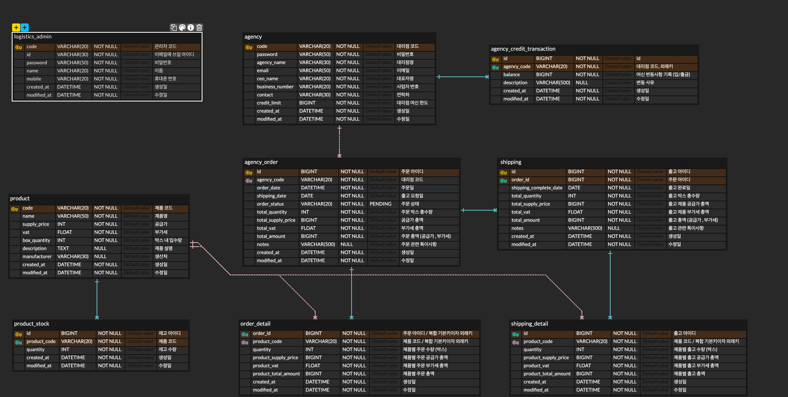

# 미니 물류 시스템

> <b>기본적인 물류 기능을 갖춘 미니 물류 시스템 구현</b>
>   - 창고는 1개로 가정

 

---

# 사용 기술
> Java, Spring-Boot, Spring-Security, Elasticsearch, MySQL, Redis

 

---

# 프로젝트 기능

## 인증 / 인가

- 회원가입
  - 관리자만 회원가입을 진행
  - 대리점은 관리자가 대리점을 등록 후 로그인만 진행할 수 있음
- 로그인
  - 관리자 사원코드 / 대리점 코드 & 비밀번호로 로그인

## 등록

- 제품 등록 (관리자)
- 대리점 등록 (관리자)
- 대리점 여신 등록 (관리자)
  - 대리점 여신 추가 및 수정 
- 재고 관리 (관리자)
  - 등록된 제품 재고 추가 및 수정
- 주문 등록
  - 출고 요청일, 제품 코드와 박스 수량으로 주문 등록
  - 대리점 여신 부족 시 주문 저장 불가
  - 주문 마감 시간 이후 주문 등록 불가 (출고일 전날 16:00 주문 마감)
  - 단 관리자는 필요에 따라 주문 마감시간 이후에도 주문을 등록할 수 있음

## 물류 처리

- 주문 마감 시간 수정 (관리자)
  - 자동으로 출고일 전날 16:00 주문 마감되나 관리자는 주문 마감 시간을 수기로 조정 가능
- 주문 수정
  - 관리자 : 주문 마감 후에도 관리자는 주문 수정 가능
  - 대리점 : 주문 마감 전에만 주문 수정 가능
- 주문 상태 수정 (관리자)
  - 주문 마감 후 관리자는 대리점별 주문을 확인하여 출고 확정 처리 진행
  - 출고 처리를 진행하지 않으면 미출고로 출고 날 미출고된 금액만큼 해당 대리점의 여신이 추가됨
  - 주문 상태
    - 주문 확인중 - PENDING (기본값) / 주문 확정 - CONFIRMED
    - 배차 완료 - DISPATCHED / 출고 완료 - SHIPPING_COMPLETED
    - 주문 취소 - CANCELLED / 반품 - RETURN

## 조회

- 제품 조회
  - 제품 코드, 제품명으로 검색 가능
  - 단 제품 조회 시 재고 현황은 관리자만 확인이 가능
- 주문 조회
  - 기간별, 특정 날짜별로 검색 가능
- 출고 조회
  - 기간별, 특정 날짜별로 검색 가능
- 대리점 조회 (관리자)
  - 대리점 코드, 대리점 명으로 검색 가능

 

---

# ERD

